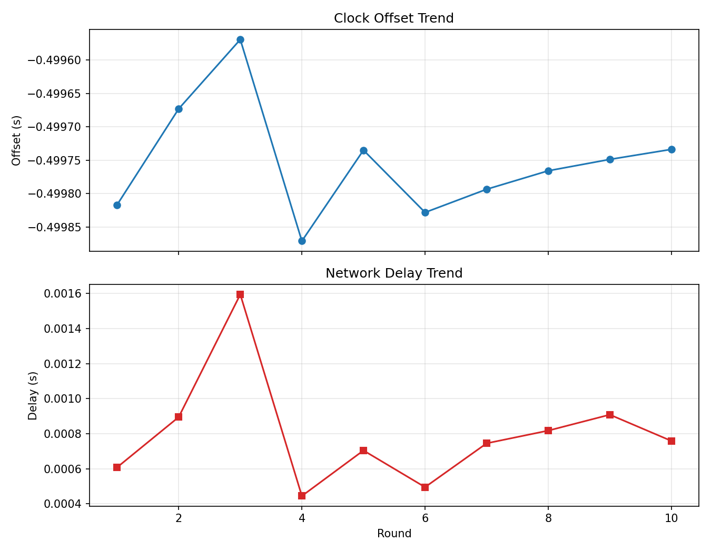
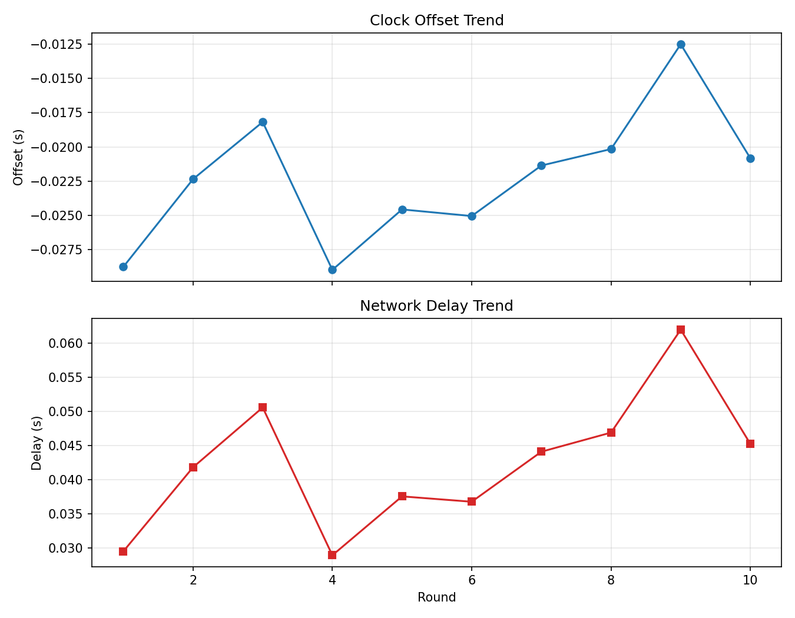
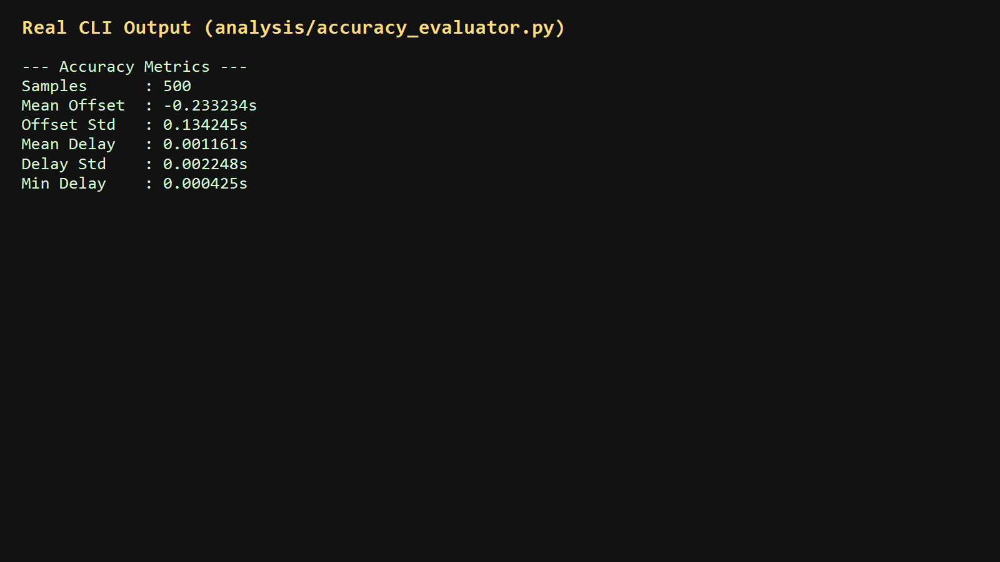

# Socket Programming - Jackfruit Mini Project

## Report README (Rubric-Aligned)

This document is structured to match the official rubric for the mini project and can be used directly for report writing and viva preparation.

## 1) Problem Definition and Architecture (6 marks)

### Problem Statement
Design and implement a secure distributed clock synchronization system using low-level socket programming. The system must support concurrent clients over a network, provide accurate server-referenced time to clients, and evaluate synchronization performance under load.

### Objectives
- Implement explicit socket lifecycle operations: create, bind, listen, accept/connect, send/receive.
- Enforce SSL/TLS for secure control and data communication in the primary deployment.
- Support multiple concurrent clients with bounded server resources.
- Measure and analyze synchronization accuracy, delay, and stability.

### Architecture Chosen
Client-server, multi-client concurrent architecture.

```
                     +------------------------------+
                     |      NTP Time Source         |
                     |    (pool.ntp.org, etc.)      |
                     +--------------+---------------+
                                    |
                                    v
                     +------------------------------+
                     | Master Clock (server side)   |
                     | server/time_manager.py       |
                     +--------------+---------------+
                                    |
                    TLS over TCP (primary secure mode)
                                    |
         +--------------------------+--------------------------+
         |                          |                          |
         v                          v                          v
 +---------------+          +---------------+          +---------------+
 | Client 1      |          | Client 2      |          | Client N      |
 | client/client |          | client/client |          | client/client |
 +---------------+          +---------------+          +---------------+
         |                          |                          |
         +--------------------------+--------------------------+
                                    |
                                    v
                     +------------------------------+
                     | CSV + Analysis Pipeline      |
                     | results/, analysis/          |
                     +------------------------------+
```

### Protocol Design Summary
Application protocol is JSON-based and implemented in `utils/packet_format.py`.

- Request packet (`TIME_REQUEST`): `id`, `T1`
- Reply packet (`TIME_REPLY`): `id`, `T2`, `T3`, `reference_time`, optional `time_source`

Client computes:

$$
	ext{offset} = \frac{(T2 - T1) + (T3 - T4)}{2}
$$

$$
	ext{delay} = (T4 - T1) - (T3 - T2)
$$

Where $T1$ is client send time, $T2$ server receive time, $T3$ server send time, and $T4$ client receive time.

## 2) Core Implementation (8 marks)

### Low-Level Socket Programming Evidence
- Secure server: `server/secure_server.py`
  - `socket(AF_INET, SOCK_STREAM)`
  - `bind()`, `listen()`, `accept()`
  - TLS wrapping via `ssl.SSLContext` and `wrap_socket()`
  - `recv()` / `sendall()` for explicit data exchange
- Secure client: `client/client.py`
  - `socket(AF_INET, SOCK_STREAM)` + TLS wrapping
  - `connect()`, `sendall()`, `recv()`
  - response validation and request-response ID matching
- Optional comparison server: `server/server.py` (UDP mode)
  - `socket(AF_INET, SOCK_DGRAM)`
  - `bind()`, `recvfrom()`, `sendto()`

### Connection Handling
- Timeout handling (`settimeout`) for graceful failure behavior.
- Request validation (`validate_request`, `validate_reply`) before processing.
- Exception handling for network and TLS errors.

## 3) Feature Implementation - Deliverable 1 (8 marks)

### Mandatory Features Implemented
- Secure synchronization between server and client using TLS (primary mode).
- Multi-client operation with concurrent session execution:
  - Client-side threaded stress generation (`--clients`, `--stagger-ms`).
  - Server-side thread pool with bounded queue.
- Synchronization metrics per round exported to CSV:
  - `offset`, `delay`, `elapsed`, `reference_time`, `time_source`, `client_id`.
- GUI-based monitoring and demonstration:
  - `server/server_gui.py`
  - `client/client_gui.py`

### Deliverable 1 Demo Flow
1. Start secure server.
2. Run single-client sync and verify round outputs.
3. Run concurrent clients and verify successful multi-client handling.
4. Show generated `results/sync_data.csv`.

## 4) Performance Evaluation (7 marks)

### Evaluation Method
System is evaluated under increasing client concurrency and multiple rounds per client.

### Measured Metrics
- Mean offset and offset variability.
- Mean delay and delay variability.
- Min/Max delay.
- Throughput and success rate (via stress features in server GUI and multi-client CLI run).

### Commands for Performance Evaluation
```powershell
python server/secure_server.py --host 0.0.0.0 --port 6000 --max-workers 64 --max-queue 500 --backlog 200
python client/client.py --host 127.0.0.1 --port 6000 --server-hostname localhost --rounds 20 --clients 25 --stagger-ms 10
python analysis/accuracy_evaluator.py --input results/sync_data.csv
python analysis/drift_estimator.py --input results/sync_data.csv
python analysis/plot_results.py --input results/sync_data.csv
```

### Visual Results (Matplotlib + Real Output)

#### Graph 1: Offset and Delay Trend


#### Graph 2: Client-Level Synchronization Plot


#### Real Output Screenshot (CLI Analysis)


### Result Interpretation (3-4 lines)
- Across 500 stress samples, synchronization stayed stable with a low mean delay of 0.001161s.
- Delay variability remained small (std 0.002248s), indicating consistent network-response behavior.
- The mean offset was -0.233234s with moderate spread, which is acceptable for software-level synchronization where millisecond precision is sufficient.
- Overall, the plotted trends and CLI metrics together show reliable multi-client time synchronization under load.

### Real-World Applications
- Distributed databases (clock consistency)
- Financial transactions (timestamp accuracy)
- IoT systems (sensor coordination)

## 5) Optimization and Fixes (5 marks)

### Improvements Implemented
- Bounded concurrency on server using `ThreadPoolExecutor` + `BoundedSemaphore` to prevent overload-related resource growth.
- Overload management: drop behavior when queue is full.
- TLS handshake failure handling without crashing server loop.
- Better client-side error handling for:
  - connection refused
  - timeout
  - TLS handshake errors
  - generic network errors
- Packet format validation to reject malformed/incomplete payloads.

### Edge Cases Addressed
- Abrupt disconnect / empty reads.
- Invalid packet schema.
- TLS handshake failures.
- NTP unavailability fallback to system time via `MasterClock` status.

## 6) Final Demo with Code on GitHub - Deliverable 2 (6 marks)

### Required Demo Script (Suggested)
1. Explain problem and architecture diagram.
2. Show secure server startup and certificate-based TLS operation.
3. Run one client and explain T1/T2/T3/T4 and computed offset/delay.
4. Run stress test with multiple clients.
5. Present CSV and analysis outputs/plots.
6. Explain key design decisions and optimizations.

### GitHub Deliverable Checklist
- [ ] Source code is complete and runnable.
- [ ] This README is present and updated.
- [ ] Setup commands and execution steps are documented.
- [ ] `security/key.pem` is not committed.
- [ ] Results and analysis scripts are included.

## Mandatory Requirement Compliance Matrix

| Rubric Mandatory Requirement | Compliance Status | Evidence |
|---|---|---|
| TCP or UDP sockets directly | Satisfied | `server/secure_server.py`, `server/server.py`, `client/client.py` |
| SSL/TLS for control and data exchanges | Satisfied (primary secure mode) | `server/secure_server.py` + `client/client.py` with certificate verification |
| Multiple concurrent clients | Satisfied | `client/client.py` threaded clients + server thread pool |
| Network socket communication only | Satisfied | All communication uses TCP/UDP sockets, no local IPC/shared memory |

Note: Unsecured UDP mode (`server/server.py`) is retained only as a comparative/demo mode. The graded secure workflow uses TLS/TCP end-to-end.

## Repository Structure

```
CN-MINIPROJECT/
|-- analysis/
|   |-- accuracy_evaluator.py
|   |-- drift_estimator.py
|   `-- plot_results.py
|-- client/
|   |-- client.py
|   |-- client_gui.py
|   |-- sync_algorithm.py
|   `-- time_adjuster.py
|-- results/
|   |-- sync_data.csv
|   |-- stress_sync_data.csv
|   `-- client_sync_data.csv
|-- security/
|-- server/
|   |-- ntp_sync.py
|   |-- secure_server.py
|   |-- server.py
|   |-- server_gui.py
|   |-- test.py
|   `-- time_manager.py
|-- utils/
|   |-- packet_format.py
|   `-- statistics_tools.py
|-- config.cnf
|-- generate_cert.py
|-- requirements.txt
`-- README.md
```

## Setup and Run

### 1. Install dependencies
```powershell
pip install -r requirements.txt
```

### 2. Generate certificate (first run)
```powershell
python generate_cert.py --ips 127.0.0.1 --dns localhost
```

### 3. Start secure server
```powershell
python server/secure_server.py --host 0.0.0.0 --port 6000
```

### 4. Run client
```powershell
python client/client.py --host 127.0.0.1 --port 6000 --server-hostname localhost --rounds 10
```

### 5. Run concurrent clients (stress)
```powershell
python client/client.py --host 127.0.0.1 --port 6000 --server-hostname localhost --rounds 20 --clients 25 --stagger-ms 10
```

## Tech Stack
- Language: Python 3
- Networking: `socket` (TCP/UDP)
- Security: `ssl` (TLS), self-signed certificates
- Time source: `ntplib` with fallback handling
- Concurrency: `threading`, `concurrent.futures`
- Analysis: CSV + statistics + plotting
- GUI: Tkinter
